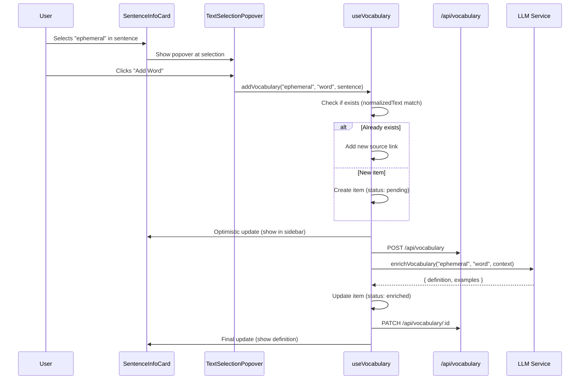
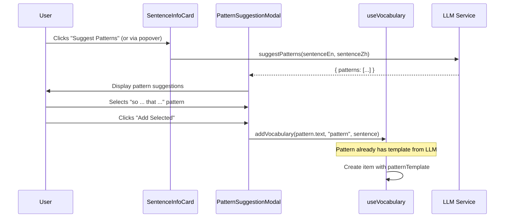

# Vocabulary Learning System - Implementation Plan

> **Codename**: Lexicon
> **Created**: 2026-02-09
> **Status**: Ready for Implementation

## 1. Executive Summary

Implement a vocabulary collection and learning system that allows users to save words, collocations, and sentence patterns during translation practice. The system uses LLM to generate definitions and examples, with a right-sidebar navigation and center detail view mirroring the existing sentence UI pattern.

### Key Decisions

| Decision | Choice | Rationale |
|----------|--------|-----------|
| Storage | Separate `vocabulary.json` | Prevents sentence data bloat; enables independent scaling |
| Data Model | Unified `VocabularyItem` with `type` discriminator | Simpler than inheritance; enables unified UI |
| Duplicate Handling | Link to existing item | Reduces redundancy; shows vocabulary usage across contexts |
| LLM Unavailable | Save as "pending" | Non-blocking UX; background enrichment when available |
| Architecture | Pragmatic Blend | Rich data model + minimal service layer + 2 LLM tasks |

---

## 2. Data Model

### 2.1 Type Definitions (`types.ts`)

```typescript
// === Vocabulary System Types ===

/**
 * Vocabulary item types
 */
export type VocabularyType = 'word' | 'collocation' | 'pattern';

/**
 * Vocabulary enrichment status
 * - pending: Saved but LLM content not yet generated
 * - enriched: LLM has generated definition and examples
 * - manual: User manually entered content (no LLM)
 */
export type VocabularyStatus = 'pending' | 'enriched' | 'manual';

/**
 * Bilingual example sentence
 */
export interface VocabularyExample {
  en: string;
  zh: string;
}

/**
 * Source sentence reference
 * Denormalized for display without loading full sentence
 */
export interface VocabularySource {
  sentenceId: string;
  en: string;           // Cached sentence text for display
  zh: string;           // Cached sentence text for display
  addedAt: number;      // When this link was created
}

/**
 * Core vocabulary item
 * Unified model for words, collocations, and patterns
 */
export interface VocabularyItem {
  id: string;                       // UUID (e.g., "vocab_1234567890_a1b2")
  text: string;                     // The word/phrase/pattern as selected
  normalizedText: string;           // Lowercase, trimmed for dedup matching
  type: VocabularyType;

  // LLM-generated or user-edited content
  definition: string;               // English explanation
  definitionZh?: string;            // Optional Chinese explanation
  examples: VocabularyExample[];    // 2-3 example sentences

  // For patterns only
  patternTemplate?: string;         // e.g., "so ... that ..." with slots
  patternExplanation?: string;      // How to use the pattern

  // User content
  note?: string;                    // Personal notes
  tags?: string[];                  // User-defined tags (reuse tag system)

  // Relationships
  sources: VocabularySource[];      // Source sentences (multiple allowed)

  // Metadata
  status: VocabularyStatus;
  createdAt: number;
  updatedAt: number;

  // Future: SRS fields (not implemented in V1)
  // masteryLevel?: number;
  // nextReviewAt?: number;
  // reviewHistory?: ReviewRecord[];
}

/**
 * Vocabulary store structure for persistence
 */
export interface VocabularyStore {
  version: number;                  // Data version for migrations
  items: VocabularyItem[];
  lastModified: number;
}

/**
 * Default empty store
 */
export const DEFAULT_VOCABULARY_STORE: VocabularyStore = {
  version: 1,
  items: [],
  lastModified: Date.now(),
};
```

### 2.2 LLM Task Types (extend existing)

```typescript
// Add to LLMTaskType union in types.ts
export type LLMTaskType =
  | 'segment'
  | 'segment-align'
  | 'translate'
  | 'score'
  | 'greeting'
  | 'enrich-vocab'      // NEW: Generate definition + examples
  | 'suggest-pattern'   // NEW: Extract patterns from sentence
  | 'custom';
```

---

## 3. Storage Architecture

### 3.1 File Location

```
public/
├── data/
│   ├── sentences.json      # Existing
│   ├── tags.json           # Existing
│   └── vocabulary.json     # NEW
```

### 3.2 API Endpoints

Add to both `server.js` and `vite.config.ts`:

| Method | Endpoint | Description |
|--------|----------|-------------|
| GET | `/api/vocabulary` | Load full vocabulary store |
| POST | `/api/vocabulary` | Save full vocabulary store |
| GET | `/api/vocabulary/:id` | Get single item by ID |
| PATCH | `/api/vocabulary/:id` | Update single item (for LLM enrichment) |
| DELETE | `/api/vocabulary/:id` | Delete single item |

### 3.3 Storage Pattern

Follow existing `sentences.json` pattern:
- Write to `public/data/vocabulary.json` (source)
- Also write to `dist/data/vocabulary.json` if exists (production)
- Atomic writes via temp file + rename

---

## 4. LLM Integration

### 4.1 Task: `enrich-vocab`

**Purpose**: Generate definition and examples for a word or collocation.

**Prompt Template** (`server/llm/prompts.ts`):

```typescript
'enrich-vocab': {
  systemPrompt: `
You are a bilingual dictionary assistant specializing in English-Chinese language learning.
Given a word or phrase and its context sentence, provide:
1. A clear, learner-friendly English definition
2. 2-3 example sentences showing natural usage (with Chinese translations)

Rules:
- Definition should explain meaning AND usage
- Examples should be at intermediate English level
- For collocations, explain what makes this combination special
- Return JSON: {
    "definition": "...",
    "definitionZh": "...",
    "examples": [{ "en": "...", "zh": "..." }, ...]
  }

Important: Only return valid JSON, no additional text.
`.trim(),

  buildUserMessage: (params) => `
Word/Phrase: ${params.text}
Type: ${params.type}
Context sentence: ${params.contextSentence}
`.trim(),

  parseResponse: (raw) => {
    const data = raw as {
      definition?: string;
      definitionZh?: string;
      examples?: Array<{ en: string; zh: string }>;
    };
    return {
      definition: data?.definition || '',
      definitionZh: data?.definitionZh,
      examples: Array.isArray(data?.examples) ? data.examples : [],
    };
  }
}
```

### 4.2 Task: `suggest-pattern`

**Purpose**: Analyze a sentence and suggest extractable patterns.

**Prompt Template**:

```typescript
'suggest-pattern': {
  systemPrompt: `
You are a grammar pattern expert for English-Chinese language learning.
Analyze the given sentence and identify grammatical patterns worth learning.

For each pattern:
1. Extract the template with slots (use ... for variable parts)
2. Explain how the pattern works
3. Provide the pattern as it appears in the sentence

Rules:
- Focus on useful, common patterns
- Patterns should be transferable to other contexts
- Limit to 1-3 most valuable patterns
- Return JSON: {
    "patterns": [{
      "text": "the original text in sentence",
      "template": "pattern with ... slots",
      "explanation": "how to use this pattern"
    }, ...]
  }

Important: Only return valid JSON, no additional text.
`.trim(),

  buildUserMessage: (params) => `
Sentence (English): ${params.sentenceEn}
Sentence (Chinese): ${params.sentenceZh}
`.trim(),

  parseResponse: (raw) => {
    const data = raw as {
      patterns?: Array<{
        text: string;
        template: string;
        explanation: string;
      }>;
    };
    return {
      patterns: Array.isArray(data?.patterns) ? data.patterns : [],
    };
  }
}
```

---

## 5. Service Layer

### 5.1 `utils/vocabularyLoader.ts`

Core CRUD operations and API client.

```typescript
// Key functions:
export const fetchVocabulary = async (): Promise<VocabularyItem[]>;
export const saveVocabulary = async (items: VocabularyItem[]): Promise<boolean>;
export const patchVocabularyItem = async (id: string, updates: Partial<VocabularyItem>): Promise<boolean>;

// ID generation
const generateVocabId = (): string => {
  const timestamp = Date.now();
  const random = Math.random().toString(36).substring(2, 6);
  return `vocab_${timestamp}_${random}`;
};

// Normalization for dedup
export const normalizeText = (text: string): string => {
  return text.toLowerCase().trim().replace(/\s+/g, ' ');
};

// Find existing item by normalized text
export const findByText = (items: VocabularyItem[], text: string): VocabularyItem | undefined => {
  const normalized = normalizeText(text);
  return items.find(item => item.normalizedText === normalized);
};
```

### 5.2 `hooks/useVocabulary.ts`

React hook for vocabulary state management.

```typescript
interface UseVocabularyReturn {
  items: VocabularyItem[];
  isLoading: boolean;
  error: string | null;

  // Actions
  addVocabulary: (text: string, type: VocabularyType, sourceSentence: SentencePair) => Promise<VocabularyItem>;
  updateVocabulary: (id: string, updates: Partial<VocabularyItem>) => Promise<void>;
  deleteVocabulary: (id: string) => Promise<void>;
  enrichPending: () => Promise<void>;  // Retry enrichment for pending items

  // Queries
  getByType: (type: VocabularyType) => VocabularyItem[];
  getBySentence: (sentenceId: string) => VocabularyItem[];
  getById: (id: string) => VocabularyItem | undefined;
}

export function useVocabulary(): UseVocabularyReturn;
```

### 5.3 `services/llmService.ts` (extend)

Add convenience methods:

```typescript
export interface EnrichVocabResult {
  success: boolean;
  data?: {
    definition: string;
    definitionZh?: string;
    examples: VocabularyExample[];
  };
  error?: string;
}

export async function enrichVocabulary(
  text: string,
  type: VocabularyType,
  contextSentence: string,
  providerId?: string,
  modelId?: string
): Promise<EnrichVocabResult>;

export interface SuggestPatternResult {
  success: boolean;
  patterns?: Array<{
    text: string;
    template: string;
    explanation: string;
  }>;
  error?: string;
}

export async function suggestPatterns(
  sentenceEn: string,
  sentenceZh: string,
  providerId?: string,
  modelId?: string
): Promise<SuggestPatternResult>;
```

---

## 6. UI Components

### 6.1 Component Tree

```
views/SentenceMode.tsx
├── components/sentence-mode/SentenceSidebar.tsx    # LEFT: Sentence list
├── components/sentence-mode/SentencePracticeArea.tsx
│   ├── SentenceDetailView.tsx                      # CENTER
│   │   └── CardCarousel
│   │       ├── SentenceInfoCard.tsx               # Modified: add text selection
│   │       ├── StatsCard.tsx
│   │       └── VocabularyCard.tsx                 # Modified: show sentence vocab
│   └── VocabularyDetailView.tsx                   # NEW: when vocab selected
│       └── VocabularyDetailCard.tsx               # NEW
└── components/vocabulary/VocabularySidebar.tsx    # NEW: RIGHT sidebar
    ├── VocabularySidebarHeader.tsx                # Filter tabs
    └── VocabularyListItem.tsx                     # List items
```

### 6.2 Layout Changes

Current layout (sentence mode):
```
┌─────────────────────────────────────────────────┐
│  [Sentence Sidebar]  │  [Sentence Detail Cards] │
│       (LEFT)         │        (CENTER)          │
└─────────────────────────────────────────────────┘
```

New layout:
```
┌───────────────────────────────────────────────────────────────┐
│  [Sentence Sidebar]  │  [Detail Cards]  │  [Vocab Sidebar]   │
│       (LEFT)         │    (CENTER)      │      (RIGHT)        │
│                      │                  │   Collapsible       │
└───────────────────────────────────────────────────────────────┘
```

### 6.3 New Components

#### `VocabularySidebar.tsx`
- Fixed width right sidebar (collapsible)
- Tabs/filter: All | Words | Collocations | Patterns
- Search input
- Virtualized list for performance
- Click item → show VocabularyDetailView in center
- Status indicators (pending = spinner)

#### `VocabularyDetailCard.tsx`
- Glass-panel styling (match existing cards)
- Header: text + type badge
- Body: definition, examples (bilingual)
- Source sentences section (clickable → navigate to sentence)
- Edit button → inline editing
- Delete button with confirmation

#### `TextSelectionPopover.tsx`
- Appears on text selection in SentenceInfoCard
- Positioned near selection
- Buttons: "Add Word" | "Add Collocation" | "Suggest Patterns"
- "Suggest Patterns" → shows LLM suggestions → user picks one

#### `PatternSuggestionModal.tsx`
- Modal showing LLM-suggested patterns
- Each pattern: text, template, explanation
- Checkboxes to select which to add
- "Add Selected" button

### 6.4 Modified Components

#### `SentenceInfoCard.tsx`
- Add `onMouseUp` handler for text selection
- Render `TextSelectionPopover` when selection exists
- Pass vocabulary context via props

#### `VocabularyCard.tsx` (existing placeholder)
- Transform from placeholder to functional component
- Show vocabulary items linked to current sentence
- Quick-add button for selected text

---

## 7. User Flows

### 7.1 Adding a Word/Collocation



### 7.2 Adding a Pattern (LLM Suggestion)



### 7.3 Viewing Vocabulary Detail

```
1. User clicks item in VocabularySidebar
2. Center view switches from SentenceDetailView to VocabularyDetailView
3. VocabularyDetailCard shows:
   - Text + type badge
   - Definition (editable)
   - Examples (editable)
   - Source sentences (clickable → returns to sentence view)
4. User clicks source sentence → center returns to SentenceDetailView
```

---

## 8. Implementation Phases

### Phase 1: Foundation (Backend + Types)
**Files to create/modify:**
- [ ] `types.ts` - Add vocabulary type definitions
- [ ] `server.js` - Add `/api/vocabulary` endpoints
- [ ] `vite.config.ts` - Mirror endpoints for dev server
- [ ] `public/data/vocabulary.json` - Initialize empty store

**Estimated effort**: 1-2 hours

### Phase 2: LLM Integration
**Files to create/modify:**
- [ ] `server/llm/prompts.ts` - Add `enrich-vocab` and `suggest-pattern` tasks
- [ ] `services/llmService.ts` - Add `enrichVocabulary()` and `suggestPatterns()`

**Estimated effort**: 1-2 hours

### Phase 3: Service Layer
**Files to create:**
- [ ] `utils/vocabularyLoader.ts` - CRUD operations
- [ ] `hooks/useVocabulary.ts` - State management hook

**Estimated effort**: 2-3 hours

### Phase 4: UI - Core Components
**Files to create:**
- [ ] `components/vocabulary/VocabularySidebar.tsx`
- [ ] `components/vocabulary/VocabularyListItem.tsx`
- [ ] `components/vocabulary/VocabularyDetailCard.tsx`
- [ ] `components/vocabulary/VocabularyDetailView.tsx`

**Files to modify:**
- [ ] `views/SentenceMode.tsx` - Integrate right sidebar
- [ ] `components/sentence-mode/SentencePracticeArea.tsx` - Add vocabulary view state

**Estimated effort**: 4-6 hours

### Phase 5: UI - Text Selection
**Files to create:**
- [ ] `components/vocabulary/TextSelectionPopover.tsx`
- [ ] `components/vocabulary/PatternSuggestionModal.tsx`

**Files to modify:**
- [ ] `components/sentence-mode/cards/SentenceInfoCard.tsx` - Add selection handling
- [ ] `components/sentence-mode/cards/VocabularyCard.tsx` - Show sentence vocabulary

**Estimated effort**: 3-4 hours

### Phase 6: Polish & Edge Cases
- [ ] Pending item retry logic
- [ ] Error handling UI
- [ ] Loading states
- [ ] Keyboard shortcuts
- [ ] Mobile responsiveness

**Estimated effort**: 2-3 hours

**Total estimated effort**: 13-20 hours

---

## 9. File Change Summary

### New Files (11)
```
utils/vocabularyLoader.ts
hooks/useVocabulary.ts
components/vocabulary/VocabularySidebar.tsx
components/vocabulary/VocabularySidebarHeader.tsx
components/vocabulary/VocabularyListItem.tsx
components/vocabulary/VocabularyDetailView.tsx
components/vocabulary/VocabularyDetailCard.tsx
components/vocabulary/TextSelectionPopover.tsx
components/vocabulary/PatternSuggestionModal.tsx
components/vocabulary/index.ts
public/data/vocabulary.json
```

### Modified Files (8)
```
types.ts
server.js
vite.config.ts
server/llm/prompts.ts
services/llmService.ts
views/SentenceMode.tsx
components/sentence-mode/SentencePracticeArea.tsx
components/sentence-mode/cards/SentenceInfoCard.tsx
components/sentence-mode/cards/VocabularyCard.tsx
```

---

## 10. Testing Checklist

### Functional Tests
- [ ] Add word from sentence → saved with pending status
- [ ] LLM enrichment → definition and examples populated
- [ ] Add same word from different sentence → links added (no duplicate)
- [ ] Add collocation → correct type stored
- [ ] Suggest patterns → LLM returns suggestions
- [ ] Add pattern → template stored correctly
- [ ] View vocabulary detail → all content displayed
- [ ] Edit vocabulary → changes persisted
- [ ] Delete vocabulary → removed from store
- [ ] Click source sentence → navigates to sentence view
- [ ] Filter by type → correct items shown
- [ ] LLM unavailable → item saved as pending
- [ ] Retry pending → enrichment attempted

### Edge Cases
- [ ] Empty text selection → popover not shown
- [ ] Very long text selection → truncation or warning
- [ ] Special characters in vocabulary → proper escaping
- [ ] Rapid additions → no race conditions
- [ ] Offline mode → graceful degradation

---

## 11. Future Enhancements (Not in V1)

1. **Spaced Repetition System (SRS)**
   - Add `masteryLevel`, `nextReviewAt`, `reviewHistory` fields
   - Flashcard review mode with SM-2 algorithm

2. **Export/Import**
   - Export to Anki deck format
   - CSV export for spreadsheet review

3. **Search & Discovery**
   - Full-text search across vocabulary
   - Similar word suggestions

4. **Statistics Dashboard**
   - Words learned over time
   - Most reviewed items
   - Mastery distribution

5. **Integration with Practice**
   - Highlight known vocabulary in sentences
   - Suggest sentences containing vocabulary for review

---

## 12. UI Design System

### 12.1 Design Philosophy

**Style**: Minimalism & Swiss Style + Bento Grid Elements

| Principle | Implementation |
|-----------|----------------|
| **Clarity** | Typography hierarchy, no decorative elements |
| **White Space** | Generous padding (2rem+), breathing room |
| **Grid-Based** | CSS Grid for card layouts, 8px baseline |
| **Monochromatic** | Subtle color palette, single accent |
| **Functional** | Every element serves a purpose |

### 12.2 Color Palette

Extend existing CSS variables in `index.html`:

```css
:root {
  /* Vocabulary-specific colors */
  --vocab-word: #3B82F6;        /* Blue - Words */
  --vocab-collocation: #8B5CF6; /* Purple - Collocations */
  --vocab-pattern: #F59E0B;     /* Amber - Patterns */

  /* Status indicators */
  --status-pending: #94A3B8;    /* Slate - Pending enrichment */
  --status-enriched: #10B981;   /* Emerald - Enriched */

  /* Minimalist neutrals */
  --vocab-card-bg: rgba(255, 255, 255, 0.03);
  --vocab-card-border: rgba(255, 255, 255, 0.06);
  --vocab-card-hover: rgba(255, 255, 255, 0.08);
}
```

### 12.3 Typography

Use existing font stack. Add vocabulary-specific classes:

```css
/* Vocabulary text styles */
.vocab-text {
  font-size: 1.125rem;      /* 18px - prominent but not loud */
  font-weight: 500;
  letter-spacing: -0.01em;
}

.vocab-definition {
  font-size: 0.9375rem;     /* 15px */
  line-height: 1.6;
  color: var(--text-secondary);
}

.vocab-example {
  font-size: 0.875rem;      /* 14px */
  font-style: italic;
  border-left: 2px solid var(--glass-border);
  padding-left: 1rem;
}
```

### 12.4 Component Specifications

#### VocabularySidebar (Right)

```
┌─────────────────────────┐
│  Vocabulary        [×]  │  ← Collapsible header
├─────────────────────────┤
│  ○ All  ○ Words  ○ ...  │  ← Segmented control (not tabs)
├─────────────────────────┤
│  🔍 Search...           │  ← Minimal search input
├─────────────────────────┤
│                         │
│  ┌───────────────────┐  │
│  │ ephemeral      ●  │  │  ← List item with status dot
│  │ word              │  │
│  └───────────────────┘  │
│                         │
│  ┌───────────────────┐  │
│  │ take for granted  │  │
│  │ collocation    ○  │  │  ← Pending status (hollow)
│  └───────────────────┘  │
│                         │
└─────────────────────────┘

Width: 280px (collapsible to 0)
Background: transparent
List item spacing: 8px
```

**CSS Implementation**:
```css
.vocab-sidebar {
  width: 280px;
  border-left: 1px solid var(--glass-border);
  transition: width 200ms ease-out;
}

.vocab-sidebar.collapsed {
  width: 0;
  overflow: hidden;
}

.vocab-list-item {
  padding: 12px 16px;
  border-radius: 8px;
  cursor: pointer;
  transition: background-color 150ms ease;
}

.vocab-list-item:hover {
  background: var(--vocab-card-hover);
}

.vocab-list-item.active {
  background: var(--vocab-card-bg);
  border: 1px solid var(--vocab-card-border);
}
```

#### VocabularyDetailCard

```
┌─────────────────────────────────────────────────┐
│                                                 │
│  ephemeral                              [Word]  │  ← Text + type badge
│                                                 │
│  ─────────────────────────────────────────────  │
│                                                 │
│  Lasting for a very short time; fleeting.      │  ← Definition
│  短暂的；转瞬即逝的                              │
│                                                 │
│  Examples                                       │
│  │ The ephemeral beauty of cherry blossoms     │
│  │ 樱花短暂易逝的美丽                            │
│                                                 │
│  │ Fame can be ephemeral in the digital age    │
│  │ 在数字时代，名声可能是短暂的                   │
│                                                 │
│  ─────────────────────────────────────────────  │
│                                                 │
│  Source Sentences                          [2]  │
│  ┌─────────────────────────────────────────┐   │
│  │ The ephemeral nature of social media... │   │  ← Clickable
│  └─────────────────────────────────────────┘   │
│                                                 │
│  [Edit]                              [Delete]   │
│                                                 │
└─────────────────────────────────────────────────┘

Max-width: 640px (centered)
Padding: 32px
Border-radius: 16px
```

**CSS Implementation**:
```css
.vocab-detail-card {
  max-width: 640px;
  margin: 0 auto;
  padding: 2rem;
  background: var(--glass-bg);
  border: 1px solid var(--glass-border);
  border-radius: 16px;
}

.vocab-type-badge {
  display: inline-flex;
  padding: 4px 10px;
  border-radius: 6px;
  font-size: 0.75rem;
  font-weight: 500;
  text-transform: uppercase;
  letter-spacing: 0.05em;
}

.vocab-type-badge.word {
  background: rgba(59, 130, 246, 0.15);
  color: #60A5FA;
}

.vocab-type-badge.collocation {
  background: rgba(139, 92, 246, 0.15);
  color: #A78BFA;
}

.vocab-type-badge.pattern {
  background: rgba(245, 158, 11, 0.15);
  color: #FBBF24;
}
```

#### TextSelectionPopover

```
          ┌─────────────────────────────┐
          │  + Word  │  + Phrase  │  ⚡  │  ← Minimal buttons
          └─────────────────────────────┘
                      ▼
              [selected text]
```

**Design Rules**:
- Appears 8px above selection
- Semi-transparent background with blur
- Disappears on click outside or Escape
- Max 3 buttons to reduce cognitive load

```css
.text-selection-popover {
  position: absolute;
  display: flex;
  gap: 4px;
  padding: 6px;
  background: rgba(15, 23, 42, 0.9);
  backdrop-filter: blur(8px);
  border: 1px solid var(--glass-border);
  border-radius: 8px;
  box-shadow: 0 4px 12px rgba(0, 0, 0, 0.3);
  z-index: 100;
}

.popover-button {
  padding: 6px 12px;
  font-size: 0.8125rem;
  border-radius: 6px;
  cursor: pointer;
  transition: background-color 150ms ease;
}

.popover-button:hover {
  background: rgba(255, 255, 255, 0.1);
}
```

### 12.5 Animation Guidelines

| Interaction | Duration | Easing | Property |
|------------|----------|--------|----------|
| Hover state | 150ms | ease | background-color, border-color |
| Sidebar collapse | 200ms | ease-out | width |
| Card appear | 200ms | ease-out | opacity, transform |
| Popover show | 150ms | ease-out | opacity, transform |
| Status change | 300ms | ease | color, background |

**Reduced Motion Support**:
```css
@media (prefers-reduced-motion: reduce) {
  .vocab-sidebar,
  .vocab-list-item,
  .vocab-detail-card,
  .text-selection-popover {
    transition: none !important;
  }
}
```

### 12.6 Icon System

Use Lucide React icons (already available in project). No emojis.

| Concept | Icon | Usage |
|---------|------|-------|
| Word | `<Type />` | Type badge, filter |
| Collocation | `<Link2 />` | Type badge, filter |
| Pattern | `<Brackets />` | Type badge, filter |
| Pending | `<Loader2 />` | Status (animated) |
| Enriched | `<Check />` | Status |
| Add | `<Plus />` | Popover buttons |
| Suggest | `<Sparkles />` | Pattern suggestion |
| Edit | `<Pencil />` | Detail card |
| Delete | `<Trash2 />` | Detail card |
| Collapse | `<PanelRightClose />` | Sidebar toggle |

### 12.7 Responsive Breakpoints

| Breakpoint | Layout Change |
|------------|---------------|
| ≥1280px | Full 3-column: Left sidebar + Center + Right sidebar |
| 1024-1279px | Right sidebar as overlay/drawer |
| 768-1023px | Single column, sidebars as bottom sheets |
| <768px | Full-screen modals for detail views |

### 12.8 Pre-Delivery Checklist

**Visual Quality**
- [ ] No emojis as icons (use Lucide)
- [ ] Type badges use correct colors
- [ ] Hover states don't cause layout shift
- [ ] Status dots align consistently

**Interaction**
- [ ] All clickable elements have `cursor-pointer`
- [ ] Focus rings visible (2px solid, 2px offset)
- [ ] Transitions are 150-300ms
- [ ] Keyboard navigation works (Tab, Arrow keys)

**Accessibility**
- [ ] Type badges have sufficient contrast
- [ ] Screen reader labels for status icons
- [ ] `prefers-reduced-motion` respected
- [ ] Popover dismissible via Escape key

---

## 13. Glossary

| Term | Definition |
|------|------------|
| **Word** | Single vocabulary item (e.g., "ephemeral") |
| **Collocation** | Fixed phrase combination (e.g., "take for granted") |
| **Pattern** | Grammatical structure with slots (e.g., "so ... that ...") |
| **Enrichment** | LLM-generated definition and examples |
| **Pending** | Vocabulary saved but not yet enriched by LLM |
| **Source** | The sentence from which vocabulary was collected |
